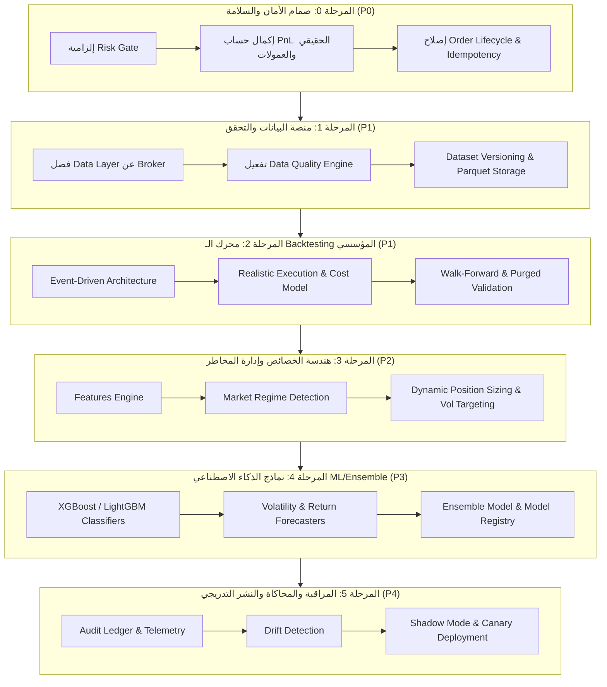

# خطة التطوير الشاملة — AI Quant Trading Platform

> **المسمى الوظيفي:** استشاري أول ومدير فريق التطوير لمنصات التداول الكمي والذكاء الاصطناعي  
> **المشروع المستهدف:** `python-trading-robot-master`  
> **المرجع الأساسي:** مراجعة وتحليل كافة تقارير مجلد [`reports/`](file:///e:/pyhton/python-trading-robot/python-trading-robot-master/python-trading-robot-master/reports)  
> **الهدف:** الانتقال المنضبط من إطار عمل تداول فني كلاسيكي إلى **منصة تداول كمي مدعومة بالذكاء الاصطناعي بمستوى مؤسسي (Production-Grade AI Quantitative Trading Platform)**.

---

## 1. الفلسفة الهندسية والقواعد الحاكمة (Guiding Principles)

بعد قراءة كافة التقارير الاستشارية والتقييمية، تم إرساء القواعد التالية كأساس لا يقبل التجاوز:

1. **النموذج يقترح — والمحفظة تحجم — والمخاطر تقر — والتنفيذ ينفذ:**
   > *(The Model proposes → Portfolio sizes → Risk authorizes → Execution routes → Ledger accounts)*
2. **الـ LLM ليس عقل التنفيذ (No LLM in the Execution Path):**
   * نماذج اللغة الكبيرة (LLMs) تُستخدم كطبقة معلومات ذكية (Intelligence/Context Layer) لاستخلاص المشاعر وتحليل الأخبار وتفسير القرارات فقط، ولا تُصدر أوامر تداول مباشرة.
3. **لا تداول حقيقي بناءً على ربحية Backtest فقط:**
   * الـ Backtest لا يعني جودة الاستراتيجية؛ يجب اجتياز اختبارات *Purged & Embargoed Cross-Validation* واختبارات السير للأمام (*Walk-Forward Analysis*) ومحاكاة مونت كارلو (*Monte Carlo*).
4. **بوابة المخاطر إلزامية وليست اختيارية (Zero Bypassing of Risk Gate):**
   * لا يمر أي أمر تداول للمنفذ إلا عبر فحص مسبق معتمد في `RiskManager` مع دعم كامل لحساب الـ PnL والعمولات والانزلاق.
5. **منع التسريب الزمني كلياً (Strict Anti-Lookahead & Anti-Leakage Bias):**
   * كل خاصية (Feature) يجب أن تُحسب حصراً بالبيانات التي كانت متاحة تاريخياً في لحظة اتخاذ القرار.

---

## 2. مصفوفة مراحل التطوير (Sprint Roadmap)

---

## 3. تفاصيل حزم العمل (Work Packages)

### 🛡️ المرحلة 0: سد الثغرات الحرجة في الأمان والمحاسبة والتنفيذ (Sprint Group 0 — P0)
* **0.1 إغلاق ثغرة `_estimate_pnl()` في [`pyrobot/risk/manager.py`](file:///e:/pyhton/python-trading-robot/python-trading-robot-master/python-trading-robot-master/pyrobot/risk/manager.py):**
  * بناء حساب PnL دقيق (Realized / Unrealized) مع خصم العمولات والفائدة ورسوم الاقتراض للـ Short والانزلاق السعري.
* **0.2 إلزامية فحص المخاطر في [`pyrobot/execution/engine.py`](file:///e:/pyhton/python-trading-robot/python-trading-robot-master/python-trading-robot-master/pyrobot/execution/engine.py):**
  * إزالة السماح بتجاوز `RiskManager` وجعل وجوده إلزامياً مع توليد استثناء صريح عند غيابه.
* **0.3 إحكام دورة حياة الأمر وتفادي التكرار (Idempotency):**
  * توليد `client_order_id` فريد غير قابل للتكرار لكل أمر، وضمان معالجة دقيقة لحالات `UNKNOWN` وإجراء الـ Reconciliation الفوري مع سجل الوسيط.
* **0.4 تفعيل الـ Kill Switch الشامل:**
  * إيقاف التداول آلياً عند انقطاع الاتصال، تلف أو قدم تدفق البيانات (`stale data`)، أو اختراق حد الخسارة اليومي.

---

### 📊 المرحلة 1: بناء منصة البيانات المستقلة (Data Platform — P1)
* **1.1 فصل طبقة البيانات:**
  * توسيع [`pyrobot/data/`](file:///e:/pyhton/python-trading-robot/python-trading-robot-master/python-trading-robot-master/pyrobot/data) لتوفير واجهات مستقلة لمصادر الأسعار (Historical / Real-time Streams / Corporate Actions / Splits).
* **1.2 تفعيل محرك فحص جودة البيانات:**
  * دمج [`DataQualityEngine`](file:///e:/pyhton/python-trading-robot/python-trading-robot-master/python-trading-robot-master/pyrobot/data/quality.py) لفحص الشموع المفقودة، والفروقات غير المنطقية، والقيم الشاذة قبل دخولها لأي استراتيجية أو نموذج.
* **1.3 تخزين وتوثيق إصدارات البيانات (Dataset Versioning):**
  * دعم التخزين بتنسيق Parquet / DuckDB مع بصمة رقمية (Checksum/Hash) تضمن التكرارية التامة (Reproducibility) في الأبحاث.

---

### ⏱️ المرحلة 2: إعادة بناء محرك الاختبار الرجعي المؤسسي (Event-Driven Backtest — P1)
* **2.1 التحول إلى Event-Driven Backtesting:**
  * فصل دورة الأحداث (`MarketEvent` → `SignalEvent` → `RiskCheckEvent` → `OrderEvent` → `FillEvent` → `PortfolioUpdate`).
* **2.2 نموذج تكاليف التداول الواقعي (`ExecutionCostModel`):**
  * استبدال نسبة الانزلاق الثابتة بنموذج ديناميكي يعتمد على: حجم الـ Spread، ومعدل التذبذب (Volatility)، ومستوى السيولة (Volume Participation)، ومحاكاة الـ Partial Fills وفارق التوقيت (Latency).
* **2.3 التحقق الصارم ومنع التحيز (Anti-Overfitting Validation):**
  * بناء آليات *Purged K-Fold Cross-Validation* مع فترات حظر زمني (*Embargo*) لمنع التسريب الزمني، واختبارات *Walk-Forward* و *Monte Carlo Stress Testing*.
* **2.4 مقاييس الأداء الشاملة:**
  * إضافة Calmar Ratio، Ulcer Index، Tail Loss، Value at Risk (VaR / CVaR)، ومصفوفات التعرض للقطاعات والعوامل.

---

### 🧠 المرحلة 3: هندسة الخصائص وإدارة أنماط السوق (Features & Regimes — P2)
* **3.1 إنشاء مكتبة الخصائص الكمية في [`pyrobot/features/`](file:///e:/pyhton/python-trading-robot/python-trading-robot-master/python-trading-robot-master/pyrobot/features):**
  * استخراج خصائص الزخم، الفروقات النسبية، التذبذب المحقق، و *Fractional Differentiation* للحفاظ على الذاكرة السعرية مع تحقيق الاستقرارية (Stationarity).
* **3.2 كاشف أنماط السوق (`MarketRegimeDetector`):**
  * تصنيف حالة السوق آلياً (اتجاه صاعد Bull، اتجاه هابط Bear، حركة عرضية Sideways، تذبذب حاد High Volatility، أزمة Crisis) لتبديل أسلوب التداول وتكييف المخاطر.
* **3.3 التحجيم الديناميكي للمراكز (Dynamic Volatility-Adjusted Sizing):**
  * استهداف مستوى تذبذب محدد للمحفظة (*Volatility Targeting / Fractional Kelly*) بدل الأحجام الثابتة.

---

### 🤖 المرحلة 4: محرك الذكاء الاصطناعي ونماذج التنبؤ (AI/ML Engine — P3)
* **4.1 خط إنتاج النماذج الجدولية المجمعة (Ensemble GBDT):**
  * بناء خطوط تدريب باستخدام LightGBM و XGBoost لتوقع احتمالية نجاح الإشارة وتوزيع العائد المتوقع ومستوى الثقة.
* **4.2 سجل وحوكمة النماذج (Model Registry & Governance):**
  * تتبع إصدارات النماذج، ومقاييس الأداء خارج العينة (OOS Metrics)، وحالة الاعتماد والترقية (*Champion vs Challenger*).
* **4.3 كشف انحراف النماذج (Model & Feature Drift Detection):**
  * مراقبة التغير في دقة التنبؤ وتوزيع المدخلات وتنبيه النظام أو خفض حجم التعرض عند تدهور أداء النموذج.

---

### 🛰️ المرحلة 5: الذكاء المساعد، المراقبة، ومسار النشر الحذر (Staging & Production — P4)
* **5.1 طبقة الذكاء المساعد (LLM Context & Sentiment Layer):**
  * دمج النماذج اللغوية لتحليل الأخبار ومشاعر السوق وتوليد شروحات لأسباب الصفقات وتقارير ما بعد التداول دون التدخل في تنفيذ الأوامر.
* **5.2 سجل التدقيق غير القابل للتعديل (Immutable Audit Ledger):**
  * تسجيل متسلسل وكامل لكل (بيانات السوق ← مخرجات النموذج ← قرار المخاطر ← تفاصيل الأمر ← الاستجابة ← التنفيذ).
* **5.3 مسار النشر المتدرج والآمن:**
  * تطبيق تسلسل النشر الإلزامي:
    1. Backtest الصارم (Walk-Forward)
    2. Paper Trading (محاكاة متكاملة)
    3. Shadow Mode (النموذج يقرر ويسجل دون إرسال أوامر حقيقية)
    4. رأس مال أولي فائق الصغر (Canary / Micro Live)
    5. التوسع الحذر والتدريجي مع مراقبة حية.

---

## 4. خطة التحقق والاختبار (Verification Plan)

### الاختبارات الآلية
* تشغيل حزمة الـ Unit Tests لكل وحدة جديدة (Data Quality, Cost Model, Features, Model Registry).
* تشغيل Integration Tests للتدفق الكامل: `Data → Feature → Model → Risk Gate → Execution → PaperBroker`.
* تشغيل اختبارات حقن الأعطال (Failure Injection Tests): انقطاع الاتصال، الشموع التالفة، وتجاوز حدود المخاطر.
* التحقق من سلامة الأنواع والكود: `mypy` و `ruff` و `pytest --cov`.

### المراجعة والمحاكاة
* تشغيل استراتيجية اختبارية على بيئة Paper Trading و Shadow Mode ومقارنة قرارات النماذج بالواقع السعري.
