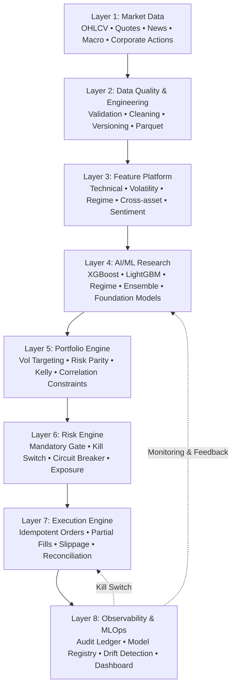
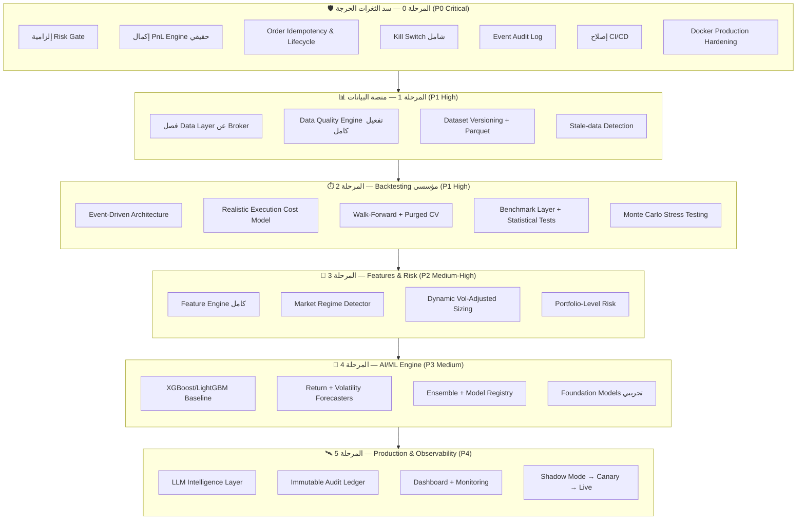

# خطة التطوير الشاملة والنهائية — AI Quant Trading Platform

> **المسمى الوظيفي:** استشاري أول ومدير فريق التطوير لمنصات التداول الكمي والذكاء الاصطناعي
> **المشروع:** `python-trading-robot-master`
> **الإصدار:** v2.0 — خطة مُحدّثة ومُدمجة
> **التاريخ:** 20 أغسطس 2026
> **المرجع:** تحليل ودمج **7 تقارير استشارية وفنية** + تقرير تقييم استشاري خارجي
> **الهدف:** الانتقال المنضبط من إطار عمل تداول فني كلاسيكي إلى **منصة تداول كمي مدعومة بالذكاء الاصطناعي بمستوى مؤسسي**

---

## مصفوفة التقييم الحالية (إجماع التقارير)

| المحور | التقييم المُجمَّع | الحالة |
|---|:---:|---|
| جودة النواة البرمجية | **7-8/10** | ✅ قوية |
| Broker Abstraction | **7.5-8.5/10** | ✅ ممتازة |
| إدارة المخاطر (كمفهوم) | **4-7/10** | ⚠️ موجودة لكن ناقصة |
| طبقة التنفيذ Execution | **6.5/10** | ⚠️ بحاجة تعزيز |
| جودة Backtesting | **4-4.5/10** | 🔴 غير كافٍ |
| الجاهزية للإنتاج | **3.5-4/10** | 🔴 غير جاهز |
| الذكاء الاصطناعي AI/ML الفعلي | **2/10** | 🔴 غير موجود |
| MLOps / Model Governance | **1.5/10** | 🔴 غير موجود |
| **قابلية التطوير إلى منصة قوية** | **8.5-9/10** | ✅ **فرصة ممتازة** |

> [!IMPORTANT]
> **إجماع جميع التقارير:** المشروع يمتلك نواة هندسية قوية جداً قابلة للتطوير إلى منصة Quant Trading حقيقية، لكنه حالياً **Trading Infrastructure Foundation** وليس **AI Trading Platform**. التسمية `AI-ready` أدق من `AI-powered`.

---

## 1. الفلسفة الهندسية والقواعد الحاكمة غير القابلة للتجاوز

بعد تحليل ودمج كافة التقارير الاستشارية، تم إرساء القواعد التالية:

### 1.1 سلسلة القرار الذهبية (Golden Decision Chain)

```text
AI Model يقترح → Portfolio يُحدد الحجم → Risk يُوافق → Execution يُنفذ → Reconciliation يُثبت → Ledger يُحاسب
```

> [!CAUTION]
> **لا يمر أي أمر تداول إلى المنفذ إلا عبر فحص مسبق في RiskManager — بدون استثناء.**

### 1.2 قواعد لا تقبل التجاوز

1. **الـ LLM ليس عقل التنفيذ:** نماذج اللغة تُستخدم كطبقة معلومات ذكية فقط (أخبار، مشاعر، تفسير) — ولا تُصدر أوامر تداول
2. **لا تداول حقيقي بناءً على Backtest فقط:** يجب اجتياز Walk-Forward + Purged CV + Monte Carlo + Shadow Mode
3. **منع التسريب الزمني كلياً (Anti-Lookahead):** كل Feature تُحسب حصراً بالبيانات المتاحة تاريخياً
4. **بوابة المخاطر إلزامية:** `RiskManager: None` = ممنوع في الإنتاج
5. **الانتقال التدريجي الإلزامي:** Backtest → OOS → Paper → Shadow → Micro Live → Controlled Scale

---

## 2. المعمارية المستهدفة (8 طبقات)



---

## 3. مراحل التطوير التفصيلية (Sprint Roadmap)



---

## 4. تفاصيل حزم العمل

### 🛡️ المرحلة 0: سد الثغرات الحرجة (Sprint Group 0 — P0 CRITICAL)

> [!CAUTION]
> **هذه المرحلة لا تقبل التأجيل.** لا يُسمح بأي تطوير AI/ML قبل إكمالها.

#### 0.1 إلزامية Risk Gate في Execution Engine

**الملف:** [`pyrobot/execution/engine.py`](file:///e:/pyhton/python-trading-robot/python-trading-robot-master/python-trading-robot-master/pyrobot/execution/engine.py)

- إزالة `risk_manager: RiskManager | None = None` وجعله إلزامياً
- توليد `RuntimeError` صريح عند محاولة التنفيذ بدون Risk Context
- إضافة `RiskDecision` كنتيجة موثقة لكل فحص مخاطر قبل التنفيذ

#### 0.2 إكمال PnL Engine حقيقي

**الملف:** [`pyrobot/risk/manager.py`](file:///e:/pyhton/python-trading-robot/python-trading-robot-master/python-trading-robot-master/pyrobot/risk/manager.py)

> [!WARNING]
> `_estimate_pnl()` تُرجع `0.0` حالياً — وهذا يعني أن Circuit Breaker و Daily Loss Limit و Loss Streak كلها **معطلة فعلياً**.

- بناء حساب PnL دقيق: Realized + Unrealized
- خصم: العمولات، الفائدة، رسوم الاقتراض (Short)، الانزلاق السعري
- دعم FX conversion عند تعدد العملات (مستقبلي)

#### 0.3 Order Lifecycle & Idempotency

**الملف:** [`pyrobot/models/order.py`](file:///e:/pyhton/python-trading-robot/python-trading-robot-master/python-trading-robot-master/pyrobot/models/order.py)

- توليد `client_order_id` فريد (UUID4) لكل أمر — غير قابل للتكرار
- معالجة حالة `UNKNOWN` مع Reconciliation فوري مع سجل الوسيط
- منع duplicate orders عند API retry / network timeout / process restart
- التأكد من أن Canonical Order Schema واحد لكل broker adapter

#### 0.4 Kill Switch شامل

- إيقاف فوري عند: انقطاع الاتصال، تلف/قدم البيانات، اختراق حد الخسارة اليومي
- إيقاف عند: position mismatch غير متوقع، فشل متكرر في الأوامر، فشل خدمة النموذج
- جعل Kill Switch عالمياً يشمل جميع الوسطاء

#### 0.5 Event Audit Log (طبقة مفقودة حرجة)

> [!IMPORTANT]
> **جميع التقارير أجمعت على أن Audit Trail مفقود وضروري.** لا يمكن تشغيل تداول حقيقي بدون تسجيل قابل للتتبع.

- إنشاء `pyrobot/audit/ledger.py` — سجل تسلسلي غير قابل للتعديل
- تسجيل: Market Snapshot → Model Output → Risk Decision → Order → Broker Response → Fill → PnL

#### 0.6 إصلاح CI/CD

**الملف:** [`.github/workflows/ci.yml`](file:///e:/pyhton/python-trading-robot/python-trading-robot-master/python-trading-robot-master/.github/workflows)

- إزالة `continue-on-error: true` على mypy — في نظام مالي type-checking فاشل = build فاشل
- تحديث CodeQL workflow من actions قديمة + توجيهه إلى `main` بدل `master`
- إضافة secret scanning + dependency scanning

#### 0.7 Docker Production Hardening

**الملف:** [`docker-compose.yml`](file:///e:/pyhton/python-trading-robot/python-trading-robot-master/python-trading-robot-master/docker-compose.yml)

- تثبيت versions محددة (إزالة `:latest` من Grafana وغيرها)
- إزالة كلمات المرور الافتراضية (`admin`, `changeme`)
- تحويل الـ runtime container من مجرد `print('loaded ok')` إلى Trading Daemon فعلي

---

### 📊 المرحلة 1: منصة البيانات المستقلة (Data Platform — P1)

#### 1.1 فصل طبقة البيانات عن طبقة الوسيط

**المسار:** [`pyrobot/data/`](file:///e:/pyhton/python-trading-robot/python-trading-robot-master/python-trading-robot-master/pyrobot/data)

- إنشاء `MarketDataProvider` abstraction مع adapters متعددة
- فصل واضح بين: Historical / Real-time Streams / Replay / Research Data
- دعم Corporate Actions (Splits, Dividends, Delistings)

#### 1.2 تفعيل Data Quality Engine بالكامل

**الملف:** [`pyrobot/data/quality.py`](file:///e:/pyhton/python-trading-robot/python-trading-robot-master/python-trading-robot-master/pyrobot/data/quality.py)

- فحص: Missing candles, Duplicated, Wrong timestamps, Negative prices
- فحص: Impossible OHLC relationships, Zero volume, Suspicious gaps
- كل dataset يحمل: `dataset_id`, `source`, `retrieved_at`, `time_range`, `data_version`, `checksum`

#### 1.3 تخزين وتوثيق إصدارات البيانات

- تخزين Parquet / DuckDB مع بصمة رقمية (Checksum) تضمن Reproducibility
- فصل raw data عن processed data

#### 1.4 Stale-data Detection

- كشف تلقائي للبيانات القديمة أو المتوقفة
- تنبيه أو إيقاف تلقائي عند اكتشاف بيانات قديمة

---

### ⏱️ المرحلة 2: إعادة بناء Backtesting Engine (Event-Driven — P1)

> [!WARNING]
> **هذه أهم مرحلة تقنية** — جميع التقارير أجمعت على أن الـ Backtester الحالي غير كافٍ لتقييم استراتيجية بشكل موثوق.

#### 2.1 التحول إلى Event-Driven Backtesting

```text
MarketEvent → SignalEvent → RiskCheckEvent → OrderEvent → FillEvent → PortfolioUpdate
```

- فصل كل مرحلة كحدث مستقل
- منع الخلط بين مراحل القرار داخل loop واحدة

#### 2.2 Realistic Execution Cost Model

- استبدال `price * (1 ± slippage_pct)` بنموذج ديناميكي:
  - Bid/Ask Spread simulation
  - Market Impact (Volume Participation)
  - Partial Fills
  - Latency + Execution Delay
  - Order Queue approximation
  - Gap Risk
  - Trading Session awareness

#### 2.3 Walk-Forward + Purged Cross-Validation

```text
Train 2020-2022 → Validate 2023 → Test 2024
Train 2021-2023 → Validate 2024 → Test 2025
```

- Purged K-Fold مع فترات Embargo لمنع التسريب الزمني
- Out-of-Sample (OOS) منفصلة تماماً عن Training

#### 2.4 Benchmark Layer + Statistical Validation

مقارنة إلزامية مع:
- Buy & Hold
- Random Walk
- Volatility Benchmark
- Market Benchmark
- Simple Technical Baseline

مقاييس إضافية:
- Calmar Ratio, Ulcer Index, VaR/CVaR, Tail Loss
- Monte Carlo / Bootstrap Analysis
- Statistical Significance Tests
- Parameter Stability Analysis
- Regime-specific Evaluation

---

### 🧠 المرحلة 3: Features & Risk & Portfolio (P2)

#### 3.1 Feature Engine شامل

**المسار:** [`pyrobot/features/`](file:///e:/pyhton/python-trading-robot/python-trading-robot-master/python-trading-robot-master/pyrobot/features)

| مجموعة | أمثلة |
|---|---|
| Price | Returns, Log Returns, Momentum, Rolling High/Low, Gap |
| Technical | RSI, EMA, ADX, VWAP, OBV, Ichimoku, MACD |
| Volume | Volume Change, Relative Volume, VWAP Deviation |
| Volatility | Historical/Realized Vol, ATR, Vol Percentile |
| Market Context | Index Trend, Market Breadth, Sector Performance, Risk-on/off |
| Microstructure | Spread, Volume Imbalance (مستقبلي) |

- اختبارات آلية لاكتشاف Look-ahead Bias / Target Leakage
- Fractional Differentiation للحفاظ على الذاكرة مع الاستقرارية

#### 3.2 Market Regime Detector

```text
Bull → Trend Following
Sideways → Mean Reversion
High Volatility → Reduce Position Size
Crisis → Risk-Off / No Trade
```

- كاشف آلي يُصنف: Bull, Bear, Sideways, High Vol, Low Vol, Crisis
- ربط مباشر مع Strategy و Risk Engine

#### 3.3 Dynamic Position Sizing (Vol-Adjusted)

- استهداف مستوى تذبذب محدد للمحفظة (Volatility Targeting / Fractional Kelly)
- Position Size = f(Confidence, Volatility, Exposure, Correlation, Drawdown State)
- **Position Size هو output من Risk Engine — وليس Strategy**

#### 3.4 Portfolio-Level Risk

```text
Gross/Net Exposure → Sector Exposure → Factor Exposure → Correlation →
Concentration → Portfolio Volatility → Portfolio Drawdown
```

- منع فتح صفقات "تبدو مختلفة لكنها تتحرك كصفقة واحدة"

---

### 🤖 المرحلة 4: AI/ML Engine (P3)

> [!NOTE]
> **ابدأ من الأبسط.** الهدف ليس "أكثر موديل تعقيداً" بل "نموذج قوي + قابل للتفسير + مستقر + لا يعاني من overfitting".

#### 4.1 Baseline Models

```text
Model A — Regime Detection (Bull/Bear/Sideways/HighVol/Crisis)
Model B — Return Forecast (P(return > threshold), Expected Return, Prediction Interval)
Model C — Volatility Forecast
```

أدوات: XGBoost, LightGBM, CatBoost, Random Forest, Logistic Regression

#### 4.2 Ensemble Model

```text
Trend Model + Momentum Model + Volatility Model + Regime Model + Technical Strategy
→ Ensemble → Final Probability + Confidence + Expected Return + Expected Risk
```

#### 4.3 Model Registry & Governance

- تتبع: `model_id`, `version`, `training_period`, `features_version`, `dataset_version`
- حالة: Champion vs Challenger
- عدم السماح بتشغيل نموذج بدون Version واضح وApproval

#### 4.4 Model & Feature Drift Detection

- مراقبة: Prediction Drift, Feature Drift, Confidence Drift, Calibration
- عند التدهور: `ALERT` → خفض التعرض أو إيقاف — **وليس** `KEEP TRADING` بشكل أعمى

#### 4.5 Foundation Models (تجريبي - مستقبلي)

- بعد بناء baseline قوي: اختبار TimesFM, Chronos, Moirai
- المعيار: *"Does it create economically significant OOS improvement after fees, slippage and risk constraints?"*
- إذا لم يفعل → يُستبعد

---

### 🛰️ المرحلة 5: Production, Intelligence & Observability (P4)

#### 5.1 LLM Intelligence Layer (ليس Execution Brain)

استخدامات مقبولة:
```text
News Classification → Sentiment Extraction → Event Detection →
Market Commentary → Trade Explanation → Post-trade Analysis → Anomaly Explanation
```

> [!CAUTION]
> الـ LLM لا يُرسل Orders مباشرة. مخرجاته تذهب إلى Feature/Signal Engine فقط.

#### 5.2 Immutable Audit Ledger

كل قرار قابل لإعادة البناء:
```text
timestamp → symbol → market state → features → model version → signal →
confidence → risk decision → position size → order → broker response →
fill → result
```

#### 5.3 Observability Dashboard

```text
Account Equity • Daily PnL • Drawdown • Open Positions • Exposure •
Orders • Fills • Rejected Orders • Latency • Model Confidence •
Current Regime • Strategy Performance • Broker Health • Data Health
```

#### 5.4 مسار النشر المتدرج الإلزامي

```text
1. Backtest الصارم (Walk-Forward + OOS)
2. Paper Trading (محاكاة متكاملة)
3. Shadow Mode (النموذج يقرر ويسجل — بدون أوامر حقيقية)
4. Very Small Capital (Canary / Micro Live)
5. Controlled Live
6. التوسع الحذر والتدريجي مع مراقبة حية
```

---

## 5. ما يجب الاحتفاظ به vs ما يجب إعادة هندسته

### ✅ يُحتفظ به (الأساس القوي)

| المكون | السبب |
|---|---|
| Broker Abstraction | تصميم ممتاز — Multi-broker |
| Canonical Order/Signal Models | متقدمة — تحتاج تعبئة بمنطق حقيقي |
| Paper Broker | أساس جيد للمحاكاة |
| Risk Packages | بنية واعدة تحتاج إكمال |
| Execution Package | اتجاه صحيح |
| Exception Hierarchy | تصنيف ممتاز |
| Docker Foundation | Multi-stage + healthcheck |
| Unit Tests + CI | نقطة قوة |

### 🔄 يُعاد هندسته

| المكون | السبب |
|---|---|
| Backtesting | غير كافٍ — يحتاج Event-driven + Realistic Costs |
| Market Data Layer | مختلط مع Broker — يحتاج فصل |
| Risk ↔ Execution Integration | Risk اختياري حالياً — يجب أن يكون إلزامياً |
| PnL Accounting | `_estimate_pnl()` = `0.0` — حرج |
| Reconciliation | يحتاج event-driven reconciliation كامل |
| Persistence | JSON غير كافٍ — Parquet/DuckDB/PostgreSQL |
| ML/AI Architecture | غير موجود — يُبنى من الصفر |
| Observability | محدود — يحتاج Dashboard + Metrics + Alerting |

---

## 6. الممنوعات القاطعة

| # | ممنوع | السبب |
|---|---|---|
| 1 | إدخال ChatGPT كـ"Trader" | LLM ليس execution engine |
| 2 | تدريب نموذج على OHLCV ونشره مباشرة | بدون leakage control / walk-forward = خسارة مؤكدة |
| 3 | تحسين Sharpe فقط | Sharpe عالي جداً = علامة overfitting |
| 4 | زيادة تعقيد النموذج قبل Data Pipeline | نموذج متقدم + بيانات سيئة = overfit أسرع |
| 5 | إضافة عشرات المؤشرات بدون hypothesis | ميزات بلا فرضية = noise |
| 6 | Backtest → Live مباشرة | يجب المرور بـ Paper → Shadow → Micro |
| 7 | اختيار Hyperparameters من نفس Test Set | Data Leakage |
| 8 | توسيع رأس المال بعد أول نتائج إيجابية | الاستقرار أولاً |

---

## 7. قرار Go / No-Go الحالي

| السيناريو | القرار |
|---|---|
| التجارب والتعليم | ✅ **GO** — مناسب جداً |
| Paper Trading | ⚠️ **GO مع تحسينات** — بشرط إكمال Phase 0 |
| Small Controlled Live Capital | 🔴 **NO-GO حالياً** — حتى تكتمل Phase 0 + 1 + 2 |
| منصة مؤسسية / SaaS | ✅ **GO على مستوى الاستثمار الهندسي** — لكن تحتاج إعادة بناء عدة طبقات |

---

## 8. خطة التحقق والاختبار

### الاختبارات الآلية

- Unit Tests لكل وحدة جديدة (PnL Engine, Cost Model, Features, Model Registry, Audit Ledger)
- Integration Tests: `Data → Feature → Model → Risk Gate → Execution → PaperBroker`
- Failure Injection Tests: انقطاع اتصال، شموع تالفة، تجاوز حدود المخاطر
- Broker Contract Tests: تحقق من Canonical Order Schema لكل adapter
- Duplicate Order Tests, Partial Fill Tests, Stale Data Tests
- Type checking: `mypy` (إلزامي — بدون `continue-on-error`)
- Linting: `ruff`
- Coverage: `pytest --cov` مع حد أدنى

### المراجعة والمحاكاة

- تشغيل استراتيجية اختبارية على Paper Trading + Shadow Mode
- مقارنة قرارات النماذج بالواقع السعري
- مراجعة Audit Trail لضمان قابلية التتبع الكامل

---

## 9. معيار "Definition of Done" لكل Feature

```text
Implementation + Unit Tests + Integration Tests + Error Handling +
Logging + Documentation + Metrics + Security Review
```

**لا تُعتبر أي Feature مكتملة لمجرد أن الكود يعمل.**

---

## 10. التوصية النهائية

> **لا تبدأ من الصفر** — هذا سيكون إهداراً للعمل الجيد الموجود.
> **ولا تُضف AI مباشرة** — هذا سيكون خطأ معمارياً.

### الترتيب الصحيح:

```text
1. Safety & Risk Gate (P0)
2. PnL & Accounting (P0)
3. Execution Hardening (P0)
4. Audit Trail (P0)
5. Data Platform (P1)
6. Research-grade Backtesting (P1)
7. Feature Engine & Regime Detection (P2)
8. Quant Models (P3)
9. AI Forecasting & Ensemble (P3)
10. MLOps & Model Governance (P3)
11. LLM Intelligence Layer (P4)
12. Shadow Trading (P4)
13. Canary → Production (P4)
```

> [!IMPORTANT]
> **القاعدة الذهبية:** *"The model should propose risk-adjusted opportunities; it should never own the money path."*

---

## User Review Required

> [!IMPORTANT]
> ### نقاط تحتاج قرارك قبل البدء:
>
> 1. **أولوية البدء:** هل نبدأ بـ Phase 0 (سد الثغرات الحرجة) فوراً؟
> 2. **الواجهة الأمامية:** هل تريد بناء Dashboard (React/Vite) بالتوازي مع Phase 0، أم تؤجلها إلى Phase 5؟
> 3. **نطاق Phase 0:** هل نُنفذ كل بنود Phase 0 دفعة واحدة، أم نقسمها إلى حزم أصغر؟
> 4. **قاعدة البيانات:** هل تفضل PostgreSQL أم DuckDB أم كليهما لتخزين البيانات والسجلات؟
